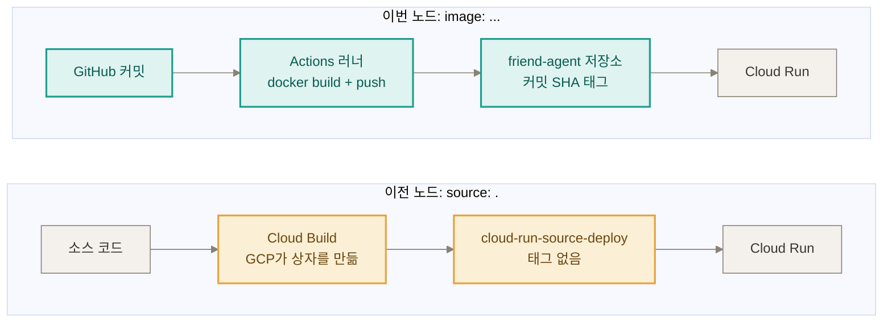

```mermaid
%%{init: {'theme': 'base', 'themeVariables': {'lineColor': '#8a8177', 'primaryTextColor': '#3b3630', 'fontSize': '15px'}}}%%
flowchart LR
  subgraph OLD["이전 노드: source: ."]
    direction LR
    S1["소스 코드"]:::doc --> CB["Cloud Build<br/>GCP가 상자를 만듦"]:::ctr --> R1["cloud-run-source-deploy<br/>태그 없음"]:::ctr --> CR1["Cloud Run"]:::doc
  end
  subgraph NEW["이번 노드: image: ..."]
    direction LR
    S2["GitHub 커밋"]:::img --> AC["Actions 러너<br/>docker build + push"]:::img --> R2["friend-agent 저장소<br/>커밋 SHA 태그"]:::img --> CR2["Cloud Run"]:::doc
  end
  classDef doc fill:#f4f1ec,stroke:#8a8177,color:#3b3630
  classDef img fill:#dff3f0,stroke:#1f9e8f,stroke-width:2px,color:#085c52
  classDef ctr fill:#fbefd5,stroke:#e8a33d,stroke-width:2px,color:#6b4710
```
